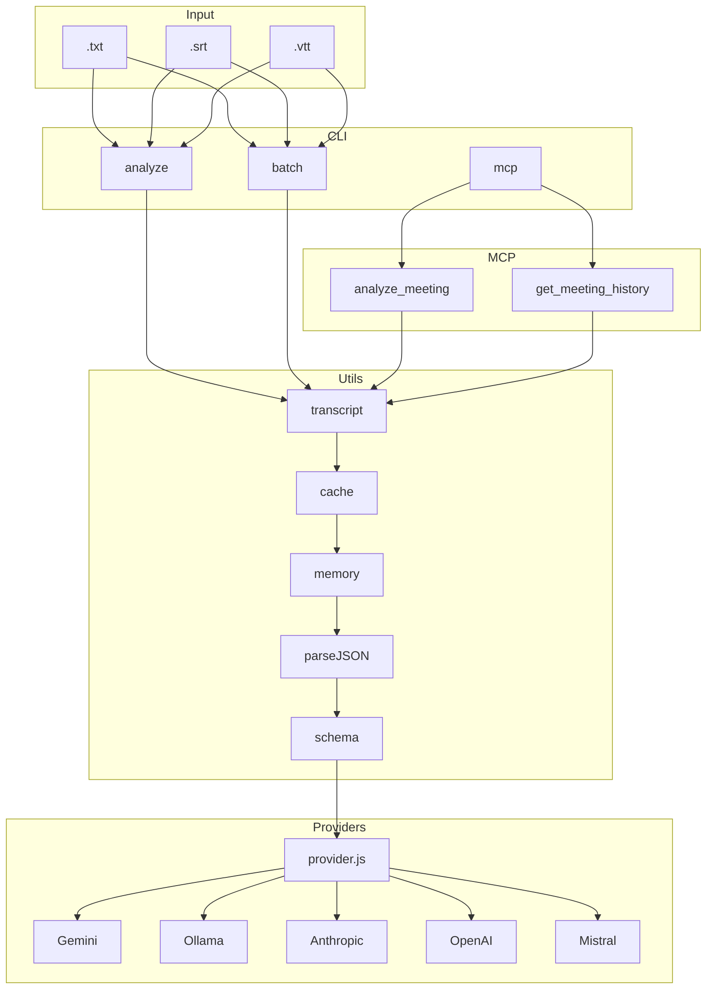

# TeamPulse

[](https://www.npmjs.com/package/teampulse)
[](LICENSE)

CLI con IA para analizar reuniones. Extrae resumen, tareas, riesgos y decisiones de transcripciones (`.txt`, `.srt`, `.vtt`) usando Gemini, Ollama, Anthropic, OpenAI o Mistral.

**v1.1.0** · Node.js >= 18 · MIT

```bash
npx teampulse analyze meeting.txt
npm i -g teampulse
```

## Contenido

- [Instalación](#instalación)
- [Configuración](#configuración)
- [Uso CLI](#uso-cli)
- [Servidor MCP](#servidor-mcp)
- [Cursor](#cursor)
- [Formatos](#formatos)
- [Salida](#salida)
- [Arquitectura](#arquitectura)
- [Tests](#tests)
- [Licencia](#licencia)

## Instalación

```bash
npx teampulse analyze meeting.txt
npm i -g teampulse
```

Desde el código fuente:

```bash
git clone https://github.com/mcontrerasmalpar-pixel/teampulse.git
cd teampulse
npm install
```

Requiere **Node.js 18 o superior**.

Bins publicados:

| Comando | Qué hace |
| --- | --- |
| `teampulse` | CLI (`analyze`, `batch`, `eval`, `mcp`) |
| `teampulse-mcp` | Servidor MCP por stdio |

## Configuración

Define las variables del proveedor que vayas a usar:

```bash
# Gemini (por defecto)
export GEMINI_API_KEY="your-api-key"

# Ollama (local, sin API key)
export OLLAMA_BASE_URL="http://localhost:11434"
export OLLAMA_MODEL="mistral"

# Anthropic
export ANTHROPIC_API_KEY="your-api-key"
export ANTHROPIC_MODEL="claude-sonnet-4-20250514"

# OpenAI
export OPENAI_API_KEY="your-api-key"
export OPENAI_MODEL="gpt-4.1-mini"

# Mistral
export MISTRAL_API_KEY="your-api-key"
export MISTRAL_MODEL="mistral-small-latest"
```

## Uso CLI

### Una transcripción

```bash
teampulse analyze meeting.txt
teampulse analyze meeting.txt --provider ollama
teampulse analyze meeting.txt --provider gemini --fallback-provider ollama --fallback-model mistral
```

Opciones:

- `-p, --provider` — `gemini` (default), `ollama`, `anthropic`, `openai`, `mistral`
- `--fallback-provider` — proveedor si falla el principal
- `--fallback-model` — modelo del fallback

### Varias transcripciones (batch)

```bash
teampulse batch ./meetings
teampulse batch ./meetings --concurrency 3
teampulse batch ./meetings --provider gemini --fallback-provider ollama
```

### Eval (sin APIs de pago)

```bash
teampulse eval --provider fixture
```

## Servidor MCP

No uses una ruta absoluta a `src/mcp-server.js`. Arranca el bin publicado:

```bash
npx teampulse mcp
# o
npx teampulse-mcp
```

### Cursor

Este repo incluye [`.cursor/mcp.json`](.cursor/mcp.json). Al abrir el proyecto en Cursor, TeamPulse queda como servidor MCP.

Guía completa: [docs/CURSOR.md](docs/CURSOR.md).

**Settings → Tools & MCP → New MCP Server**, o este bloque en `.cursor/mcp.json` (proyecto) o `~/.cursor/mcp.json` (todos los workspaces):

```json
{
  "mcpServers": {
    "teampulse": {
      "command": "npx",
      "args": ["-y", "teampulse-mcp"],
      "env": {
        "GEMINI_API_KEY": "${env:GEMINI_API_KEY}"
      }
    }
  }
}
```

`${env:GEMINI_API_KEY}` toma la variable de tu entorno. No subas la API key al git.

1. Publica o instala el paquete que incluye el bin (`npm i -g teampulse` / `npx teampulse-mcp`).
2. Exporta `GEMINI_API_KEY` (u otra key) en el entorno.
3. Reinicia Cursor por completo (quit, no solo reload).
4. En **Tools & MCP** debe aparecer `teampulse` con tools activas.

En Agent:

- “Usa `get_meeting_history` con limit 5”
- “Llama `analyze_meeting` con provider `fixture` y esta transcripción: `TASK: Write tests | owner=maria | priority=high`”

Si `npx teampulse-mcp` aún no resuelve (versión no publicada), solo en local:

```json
{
  "mcpServers": {
    "teampulse": {
      "command": "node",
      "args": ["${workspaceFolder}/src/mcp-server.js"],
      "env": {
        "GEMINI_API_KEY": "${env:GEMINI_API_KEY}"
      }
    }
  }
}
```

Vuelve a `npx -y teampulse-mcp` cuando 1.1.0 esté en npm.

### Claude Desktop

En `claude_desktop_config.json`:

```json
{
  "mcpServers": {
    "teampulse": {
      "command": "npx",
      "args": ["-y", "teampulse-mcp"],
      "env": {
        "GEMINI_API_KEY": "your-api-key"
      }
    }
  }
}
```

### Tools

**`analyze_meeting`** — analiza una transcripción.

| Param | Requerido | Descripción |
| --- | --- | --- |
| `transcript` | sí | Texto de la reunión |
| `format` | no | `txt`, `srt` o `vtt` |
| `provider` | no | proveedor de IA |
| `fallbackProvider` | no | proveedor de respaldo |
| `useCache` | no | cache local (default `true`) |
| `timeoutMs` | no | timeout del tool |

**`get_meeting_history`** — historial en `~/.teampulse/memory.json` (`readOnlyHint: true`).

| Param | Requerido | Descripción |
| --- | --- | --- |
| `limit` | no | máximo de reuniones (default `10`) |

## Formatos

- `.txt` — texto plano
- `.srt` — SubRip (Zoom, Meet)
- `.vtt` — WebVTT (Teams, Meet)

## Salida

- **Resumen**
- **Tareas** (prioridad, owner)
- **Riesgos**
- **Decisiones**

```
✅ Analisis completado

Resumen: Team sync to discuss Q3 roadmap and blockers.

Tareas:
🔴 Fix production bug (@alice)
🟡 Update documentation (@bob)
🟢 Schedule follow-up meeting

Riesgos:
⚠️ Dependency delay from vendor

Decisiones:
✅ Adopt new CI/CD pipeline
```

Datos locales:

- Memoria: `~/.teampulse/memory.json` (escrituras atómicas)
- Cache: `~/.teampulse/cache/*.json` (clave SHA-256)
- Permisos Unix: directorio `0o700`, archivos `0o600`

## Arquitectura



Flujo: normalizar → cache SHA-256 → proveedor (timeout / retry / fallback) → validar con Zod → guardar → imprimir.

Errores HTTP:

- **401/403** — API key inválida (no reintenta)
- **429** — rate limit (`Retry-After`)
- **5xx / timeout / red** — reintento con backoff

Módulos:

- `src/index.js` — CLI (`teampulse`)
- `src/mcp-server.js` — MCP (`teampulse-mcp`)
- `src/commands/analyze.js` / `batch.js` / `eval.js`
- `src/services/provider.js`
- `src/utils/{transcript,cache,memory,parseJSON,schema}.js`

## Tests

```bash
npm test
npm run eval
```

## Contribuir

1. Fork
2. `git checkout -b feature/mi-cambio`
3. `git commit -m 'Describe el cambio'`
4. `git push origin feature/mi-cambio`
5. Abre un Pull Request

## Licencia

MIT. Ver [LICENSE](LICENSE).
