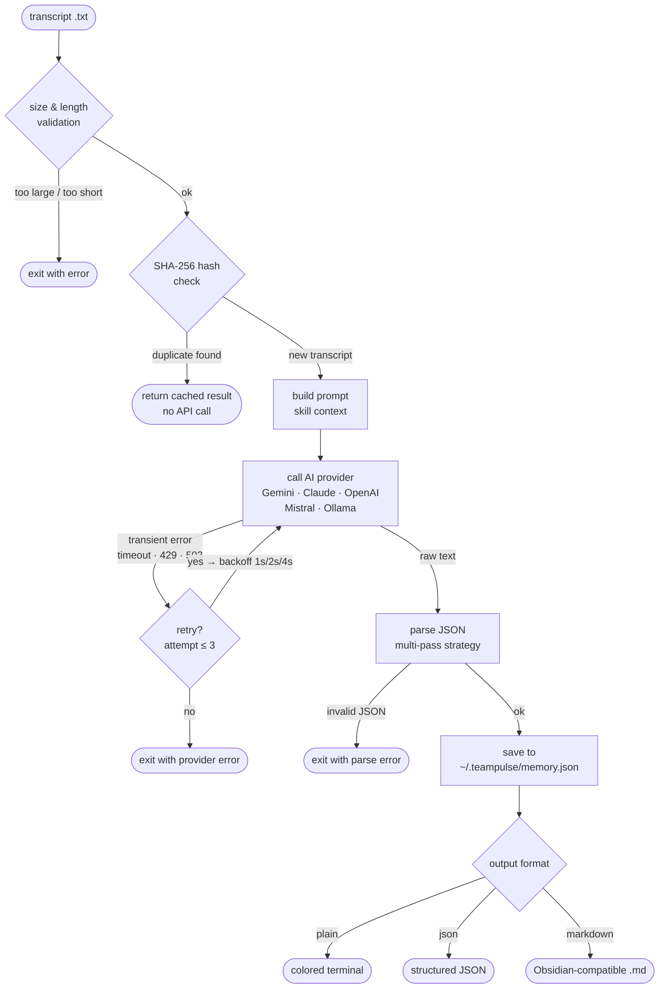

# TeamPulse

> CLI meeting intelligence. Drop in a transcript, get decisions, tasks, and risks out — cloud or fully local.

TeamPulse reads your meeting transcripts and extracts what actually matters: who decided what, what needs doing, what’s blocking the team, and how things are drifting over time. It runs in your terminal, supports five AI providers, and works fully offline with Ollama.

## What it does

- Extracts **decisions**, **tasks**, **risks**, and open questions from transcripts
- Assigns owners, priorities, and deadlines automatically
- Tracks **decision drift** across meetings
- Scans for **recurring blockers** and ownerless tasks with `watchdog`
- `--watch` mode auto-analyzes new files as they land in a folder
- **Batch analysis** across many files at once
- Interactive **chat REPL** over your meeting history
- Works with **Gemini · Claude · GPT-4 · Mistral · Ollama** (fully local, no key needed)

## Quick start

```bash
git clone https://github.com/mcontrerasmalpar-pixel/teampulse.git
cd teampulse && npm install
cp .env.example .env   # add your API key(s)
npm link
teampulse init         # interactive setup wizard
teampulse analyze data/sample.txt
```

Fully local — no API key needed:

```bash
ollama serve
ollama pull mistral
teampulse analyze data/sample.txt --provider ollama --model mistral
```

## Providers

| Provider | Flag | Env var | Default model |
|---|---|---|---|
| Google Gemini | `--provider gemini` | `GEMINI_API_KEY` | `gemini-2.0-flash` |
| Anthropic Claude | `--provider claude` | `ANTHROPIC_API_KEY` | `claude-3-5-sonnet-20241022` |
| OpenAI | `--provider openai` | `OPENAI_API_KEY` | `gpt-4o` |
| Mistral AI | `--provider mistral` | `MISTRAL_API_KEY` | `mistral-large-latest` |
| Ollama (local) | `--provider ollama` | none (`OLLAMA_HOST` optional) | `mistral` |

Override the model for any provider with `--model <name>`:

```bash
teampulse analyze meeting.txt --provider mistral --model mixtral-8x7b-instruct
teampulse analyze meeting.txt --provider ollama --model llama3
teampulse analyze meeting.txt --provider openai --model gpt-4o-mini
```

## CLI reference

### `analyze`

Analyze a single transcript file.

```bash
teampulse analyze <file> [options]

  -p, --provider <name>   gemini | claude | openai | mistral | ollama  (default: gemini)
  -m, --model <name>      override model name
  -s, --skill <skill>     product-manager | developer | founder | marketing  (default: product-manager)
  -f, --format <format>   plain | json | markdown  (default: plain)
  -o, --output <file>     save output to file
      --filter <type>     show only: decision | task | risk
      --title <label>     label this run
      --watch [dir]       watch a folder instead of analyzing a single file
```

```bash
teampulse analyze sprint-review.txt
teampulse analyze meeting.txt --provider claude --skill developer
teampulse analyze meeting.txt --provider ollama --model mistral --format markdown -o notes.md
```

### `batch`

Analyze all `.txt` files in a directory.

```bash
teampulse batch <dir> [options]

  -p, --provider <name>   AI provider
  -m, --model <name>      override model name
  -s, --skill <skill>     role skill
  -f, --format <format>   output format for --output: plain | json  (default: plain)
  -o, --output <file>     save consolidated results to file
      --since <date>      only files modified after YYYY-MM-DD
      --filter <type>     show only: decision | task | risk
```

```bash
teampulse batch ./meetings/ --provider mistral --since 2026-05-01
teampulse batch ./meetings/ --provider ollama --model llama3 --filter risk
teampulse batch ./meetings/ --output summary.md
teampulse batch ./meetings/ --output summary.json --format json
```

### `watch`

Monitor a folder and auto-analyze new `.txt` files as they appear.

```bash
teampulse watch [dir] [options]

  -p, --provider <name>   AI provider
  -m, --model <name>      override model name
  -s, --skill <skill>     role skill
```

```bash
teampulse watch ./transcripts/ --provider ollama --model mistral
```

### `drift`

Compare two meetings and surface decision drift — what changed, stalled, or was abandoned.

```bash
teampulse drift [idA] [idB] [options]
teampulse drift --last <n>       # auto-compare the N most recent meetings

  -p, --provider <name>   AI provider
  -m, --model <name>      override model name
  -l, --last <n>          auto-compare N most recent meetings
```

```bash
teampulse drift --last 2
teampulse drift abc123 def456 --provider mistral
```

### `watchdog`

Scan stored meetings for systemic issues: recurring risks, ownerless tasks, and overloaded team members.

```bash
teampulse watchdog [options]

  -p, --provider <name>   AI provider
  -m, --model <name>      override model name
  -t, --team <name>       filter by team name or keyword
  -l, --limit <n>         max meetings to scan  (default: 20)
```

```bash
teampulse watchdog --provider gemini
teampulse watchdog --provider ollama --team growth
teampulse watchdog --limit 50 --provider mistral
```

### `chat`

Interactive REPL to ask questions about your meeting history.

```bash
teampulse chat [options]

  -p, --provider <name>   AI provider
  -m, --model <name>      override model name
      --meeting <id>      focus on a specific meeting
```

```bash
teampulse chat --provider claude
teampulse chat --provider ollama --model mistral --meeting abc123
```

Inside chat, use slash commands: `/meetings`, `/use <id>`, `/clear`, `/help`, `/exit`.

### `history`

List all analyzed meetings stored in local memory.

```bash
teampulse history [options]

  -n, --limit <n>   number of meetings to show  (default: 10)
```

### `init`

Interactive setup wizard — configure API keys, default provider, and skill.

```bash
teampulse init
```

## How it works

Every `teampulse analyze` run passes through the same pipeline:



The same core pipeline powers `batch` (runs it per file), `watch` (runs it on new files), `drift` (runs it on two stored meetings), and `watchdog` (aggregates stored analyses — no new transcript needed).

## Skills

The `--skill` flag tunes the analysis lens:

| Skill | Focus |
|---|---|
| `product-manager` | Feature decisions, roadmap, delivery risks, ownership |
| `developer` | Technical decisions, architecture, blockers, tech debt |
| `founder` | Strategy, resource allocation, team alignment, market risks |
| `marketing` | Campaigns, messaging, launch timelines, audience insights |

## Output formats

- **`plain`** — colored terminal output (default)
- **`json`** — structured JSON, safe to pipe: `teampulse analyze meeting.txt --format json | jq .tasks`
- **`markdown`** — Obsidian-compatible frontmatter + sections with task checkboxes

## Local setup (Ollama)

```bash
# Start the local server
ollama serve

# Pull a model
ollama pull mistral       # fast, great for structured output
ollama pull llama3        # strong reasoning
ollama pull phi3          # lightweight

# Use a custom host
OLLAMA_HOST=http://192.168.1.10:11434 teampulse analyze meeting.txt --provider ollama
```

## Reliability

### Automatic retry

All provider calls retry up to 3 times with exponential backoff (1 s → 2 s → 4 s) on transient errors: timeouts, rate limits (429), service unavailability (503), and network resets. Permanent errors (wrong API key, unknown model) fail immediately without retrying.

### Transcript deduplication

Analyzing the same file twice skips the API call and returns the cached result. TeamPulse hashes the transcript content (SHA-256) at read time and checks it against local memory before sending any request. Re-runs are instant and free.

### Robust JSON parsing

Provider responses are parsed with a multi-pass strategy: direct parse → strip markdown code fences → extract outermost JSON object → extract outermost JSON array. This handles models that wrap their JSON in ` ```json ``` ` blocks or append trailing prose, without silently failing.

## Error handling

| Situation | What happens |
|-----------|-------------|
| File not found | Exits immediately with the full path and a tip to check the export |
| Transcript under 50 characters | Exits with "too short" — prevents wasting API quota on empty files |
| Transcript over 4 MB | Exits before reading into memory — suggests splitting the file |
| Missing API key | Exits with the exact env var name and a link to get the key |
| Rate limit / 429 | Retries up to 3× with backoff; reports attempt count on final failure |
| Timeout / network reset | Same retry logic as rate limits |
| Model not found (Ollama) | Exits with the exact `ollama pull <model>` command to run |
| Provider returns malformed JSON | Multi-pass parser strips fences and extracts the JSON object; only fails if truly unrecoverable |
| Corrupted local database | Resets `memory.json` to an empty state and continues — no crash |
| Transcript already analyzed | Returns cached result silently; no duplicate record created |
| `--since` date is invalid | Exits early with a format hint (`YYYY-MM-DD`) before reading any files |

**Tip for low-quality transcripts:** Auto-generated transcripts from noisy calls often produce garbled speaker labels and run-on sentences. TeamPulse still extracts what it can, but results improve significantly when the transcript is cleaned up first (remove filler lines, fix speaker tags). The `--skill developer` lens tends to be more tolerant of messy text than `product-manager`.

## Scalability

TeamPulse stores all analysis in a local JSON file (`~/.teampulse/memory.json`). The `--format json` and `--output` flags on both `analyze` and `batch` make it straightforward to pipe results into external systems.

### Webhook integration

Post analysis results to any HTTP endpoint after a run:

```bash
teampulse analyze meeting.txt --format json --output /tmp/result.json
curl -X POST https://hooks.slack.com/services/YOUR/WEBHOOK/URL \
  -H 'Content-Type: application/json' \
  -d "{\"text\": \"New meeting analyzed: $(jq -r .title /tmp/result.json)\"}"
```

### Connecting to a CRM

Export tasks with owners and deadlines as JSON, then map them to your CRM's API:

```bash
teampulse analyze meeting.txt --format json | jq '.tasks[] | select(.owner != null)' \
  | xargs -I{} curl -X POST https://your-crm.com/api/tasks -d {}
```

### Slack notification after batch

```bash
teampulse batch ./meetings/ --output /tmp/batch.json --format json && \
node -e "
  const r = JSON.parse(require('fs').readFileSync('/tmp/batch.json'));
  const msg = \`Batch complete: \${r.passed} meetings · \${r.tasks.length} tasks · \${r.risks.length} risks\`;
  fetch('https://hooks.slack.com/services/YOUR/WEBHOOK/URL', {
    method: 'POST', headers: {'Content-Type':'application/json'},
    body: JSON.stringify({ text: msg })
  });
"
```

### Roadmap integrations

| Target | How |
|--------|-----|
| Slack | Post analysis summary via Incoming Webhooks after each `analyze` or `batch` run |
| Notion | Push decisions and tasks to a Notion database via the Notion API using `--format json` output |
| HubSpot / Salesforce | Map task owners to CRM contacts; create follow-up activities via REST API |
| Linear / Jira | Create issues from `tasks[]` with priority and owner mapped to assignee |
| Google Calendar | Schedule follow-ups when `followUpSuggested: true` using the Calendar API |

## Requirements

- Node.js 18+
- For Ollama: [ollama.com](https://ollama.com) installed and running locally

## License

MIT
