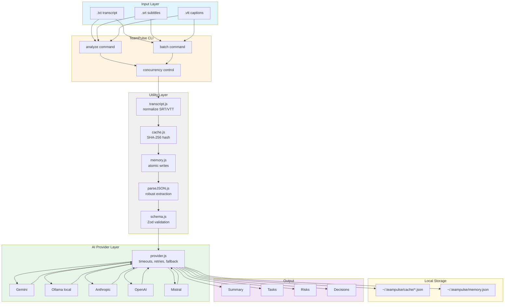

# TeamPulse

AI-powered CLI for meeting analysis. Extract summaries, tasks, risks, and decisions from transcripts (`.txt`, `.srt`, `.vtt`) using LLM providers like Gemini, Ollama, Anthropic, OpenAI, and Mistral.

## Features

- **Multiple AI providers**: Gemini, Ollama (local), Anthropic, OpenAI, Mistral
- **Fallback support**: Automatically switch to a secondary provider if the primary fails
- **Robust error handling**: Timeouts, HTTP error classification (401, 429, 5xx), retry logic
- **Local caching**: SHA-256 hash-based cache to avoid redundant API calls
- **Atomic memory**: Safe writes to prevent corruption on interruptions
- **Transcript normalization**: Support for `.srt` and `.vtt` formats from Zoom, Meet, Teams
- **Batch processing**: Analyze multiple files with configurable concurrency
- **Tests included**: 10+ unit tests for core utilities

## Architecture Overview



## Data Flow

1. **Input**: User provides transcript file(s) via `analyze` or `batch` command
2. **Normalization**: `.srt`/`.vtt` timestamps and metadata are stripped
3. **Caching**: SHA-256 hash is computed; cache is checked first
4. **Provider Call**: If not cached, request is sent to AI provider with timeout
5. **Error Handling**: HTTP errors are classified (401, 429, 5xx) and handled appropriately
6. **Fallback**: If primary provider fails after retries, secondary provider is used
7. **Validation**: Response is parsed and validated against Zod schema
8. **Storage**: Result is cached and meeting is recorded in memory
9. **Output**: Structured summary, tasks, risks, and decisions are displayed

## Installation

```bash
# Clone the repository
git clone https://github.com/mcontrerasmalpar-pixel/teampulse.git
cd teampulse

# Install dependencies
npm install
```

## Configuration

Set environment variables for your preferred AI provider:

```bash
# Gemini (default)
export GEMINI_API_KEY="your-api-key"

# Ollama (local, no API key required)
export OLLAMA_BASE_URL="http://localhost:11434"
export OLLAMA_MODEL="mistral"

# Anthropic
export ANTHROPIC_API_KEY="your-api-key"
export ANTHROPIC_MODEL="claude-sonnet-4-20250514"

# OpenAI
export OPENAI_API_KEY="your-api-key"
export OPENAI_MODEL="gpt-4.1-mini"

# Mistral
export MISTRAL_API_KEY="your-api-key"
export MISTRAL_MODEL="mistral-small-latest"
```

## Usage

### Analyze a single transcript

```bash
node src/index.js analyze meeting.txt

# With custom provider
node src/index.js analyze meeting.txt --provider ollama

# With fallback provider
node src/index.js analyze meeting.txt --provider gemini --fallback-provider ollama --fallback-model mistral
```

### Analyze multiple transcripts (batch)

```bash
node src/index.js batch ./meetings

# With custom concurrency
node src/index.js batch ./meetings --concurrency 3

# With fallback
node src/index.js batch ./meetings --provider gemini --fallback-provider ollama
```

### Supported transcript formats

- `.txt` - Plain text
- `.srt` - SubRip subtitles (Zoom, Meet exports)
- `.vtt` - WebVTT (Teams, Meet exports)

## Output

TeamPulse extracts structured information:

- **Summary**: Brief overview of the meeting
- **Tasks**: Action items with priority, owner, and due date
- **Risks**: Potential issues or blockers
- **Decisions**: Key decisions made during the meeting

Example output:

```
✅ Analisis completado

Resumen: Team sync to discuss Q3 roadmap and blockers.

Tareas:
🔴 Fix production bug (@alice)
🟡 Update documentation (@bob)
🟢 Schedule follow-up meeting

Riesgos:
⚠️ Dependency delay from vendor

Decisiones:
✅ Adopt new CI/CD pipeline
```

## Core Modules

- `src/services/provider.js` - AI provider abstraction with timeouts, retries, fallback
- `src/utils/memory.js` - Atomic writes to `~/.teampulse/memory.json`
- `src/utils/parseJSON.js` - Robust JSON extraction from LLM responses
- `src/utils/schema.js` - Zod validation for structured output
- `src/utils/transcript.js` - SRT/VTT normalization
- `src/utils/cache.js` - SHA-256 content-based caching
- `src/commands/analyze.js` - Single file analysis
- `src/commands/batch.js` - Batch processing with concurrency control

## Error Handling

- **401/403**: Invalid or expired API key (non-retryable)
- **429**: Rate limit exceeded (respects `Retry-After` header)
- **5xx**: Server errors (retryable with exponential backoff)
- **Timeout**: Provider did not respond within configured time (retryable)
- **Network errors**: Connection issues (retryable)

## Testing

```bash
# Run all tests
npm test

# Tests cover:
# - parseJSON: direct, fenced, prose-wrapped JSON
# - transcript: SRT/VTT timestamp removal
# - cache: SHA-256 hash consistency
```

## Data Storage

- **Memory**: `~/.teampulse/memory.json` (versioned, atomic writes)
- **Cache**: `~/.teampulse/cache/*.json` (SHA-256 keyed, atomic writes)
- **Permissions**: Directory `0o700`, files `0o600` (Unix)

## Contributing

1. Fork the repository
2. Create a feature branch (`git checkout -b feature/my-feature`)
3. Commit your changes (`git commit -m 'Add my feature'`)
4. Push to the branch (`git push origin feature/my-feature`)
5. Open a Pull Request

## License

MIT
